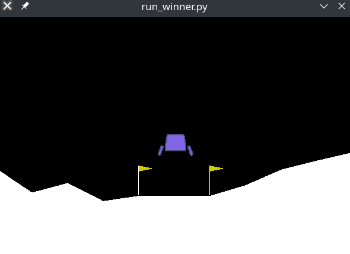
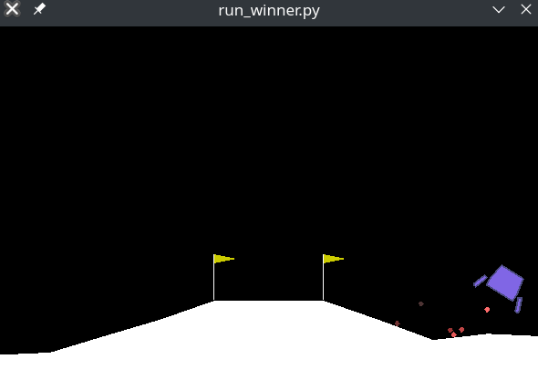
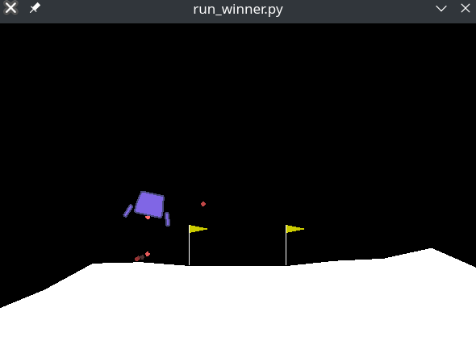

# NEAT Lunar Lander
Lunar Lander from Open AI Gym trained with the NEAT Algorithm.

## Prerequisites
* Python Version >= 3.x installed
* Pip (Python Package Manager) installed
* Make sure the swig command is available in the terminal, this command can be downloaded from [here](http://www.swig.org/download.html).

Then execute the following commands:
* `pip install wheel`
* `pip install gym`
* `pip install box2d-py`
* `pip install numpy`
* `pip install neat-python`

## How to run
There are 3 essential files in this project, each serving a different purpose.

**env_test.py**
In this file the user can test a custom fitness function with the real Lunar Lander Gym Environment. A random action sample will be choosen as the input. This is a good place to debug and analyze how the fitness function would perform.

**train_winner.py**
This file only trains a model with the NEAT algorithm and does not display any graphical output for the game. However statistical information about the training itself is provided. At the end a winner will be saved in winner/winner-feedforward.

**run_winner.py**
This file simply runs the generated winner from train_winner.py.

## Running a custom winner
In this project there are currently 4 different models for winners located in the winner directory.

* winner_Custom_no_punish_main_engine
* winner_Custom_punish_main_engine
* winner_OpenAIGym
* winner_OpenAiGym_treshold_280

The custom winners use the customized fitness function. One of the two custom winners was trained with a punishment inflicted upon using the main engine.
The OpenAi winners use the default fitness function, with one of the two winners using a different treshold value.

In order to run a custom winner all that needs to be done is modifing the path to the winner which you want to run inside the **run_winner.py** file.

